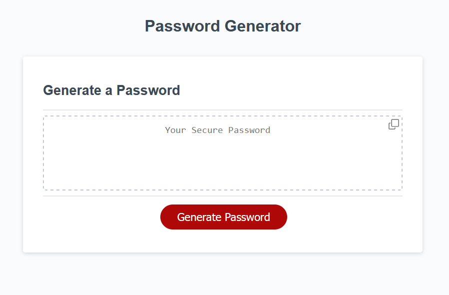

# Marcin Tatarski - Password Generator App

## Overview
Explore the capabilities of this interactive web application designed for password generation. The Password Generator provides a user-friendly experience for creating randomized passwords tailored to your specifications.

## Screenshot

*Effortlessly generate passwords using clean and responsive user interface*

## Key Highlights

- **Password Generation:**
  Generate secure passwords with a click, providing quick access to strong and randomized character combinations.

- **Customizable Criteria:**
  Tailor your passwords by specifying length and selecting character types, ensuring they meet your unique security requirements.

- **Validation:**
  - The app validates the input for the length of the password, ensuring it is at least 8 characters but not more than 128.
  - For character types, at least one type must be selected.

- **Display Options:**
  The generated password is displayed directly on the page, providing the user with the password based on their selected criteria.

- **Copy Password**
   There are two ways to copy the password, select it and use the `CTRL+C` option or click on the copy icon to copy password to the clipboard.

## How to Use

1. **Clone or Download:**
   Get the application by cloning the repository or downloading the source code to your local machine.

2. **Launch in Browser:**
   Run the app locally, open the `index.html` file in your preferred web browser.

3. **Explore on GitHub Pages:**
   Alternatively, you can use the Password Generator directly simply navigate to the [GitHub Pages](https://martindocs-bootcamp.github.io/mtatarski-password-generator/) to generate passwords.

## Credits

N/A (No contributors at this time).

## License

Please refer to the [LICENSE](./LICENSE.md) file in this repository for details on how this project is licensed.