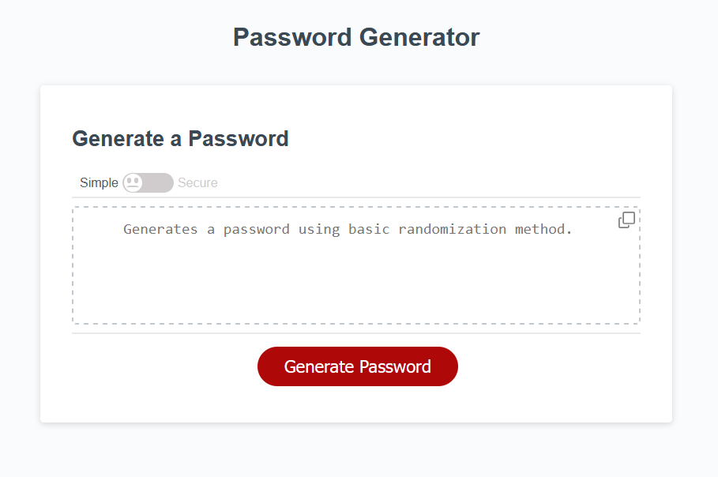

# Marcin Tatarski - Password Generator App

## Overview
Explore the capabilities of this interactive web application designed for password generation. The Password Generator provides a user-friendly experience for creating randomized passwords tailored to your specifications.

## Screenshot

*Effortlessly generate passwords using clean and responsive user interface.*

## Key Highlights

- **Level of Security:**
  User have two option to choose from to generate a password. First option, `Simple`, uses the `Math.random()` method. The second option, `Secure` uses `crypto.getRandomValues()` method, providing enhanced security through the Web Cryptography API.

- **Password Generation:**
  Generate secure passwords with a click, providing quick access to strong and randomized character combinations.

- **Customizable Criteria:**
  Tailor your passwords by specifying length and selecting character types, ensuring they meet your unique security requirements.

- **Validation:**
  The app validates the input for the length of the password and for character types, and at least one of character types must be selected.

- **Display Options:**
  The generated password is displayed directly on the page, providing the user with the password based on their selected criteria.

- **Copy Password:**
   There are two ways to copy the password, the text or using the copy icon 📋.

## Installation

1. **Clone or Download:**
   Get the application by cloning the repository or downloading the source code to your local machine.

2. **Launch in Browser:**
   Run the app locally, open the `index.html` file in your preferred web browser.

3. **Explore on GitHub Pages:**
   Alternatively, you can use the Password Generator directly simply navigate to the [GitHub Pages](https://martindocs-bootcamp.github.io/mtatarski-password-generator/) to generate passwords.

## How to Use

Follow these simple steps to generate passwords:

1. Choose your security level: Slide the toggle between `Simple` or `Secure`.
2. Click the `Generate Password` button. A popup will ask for the password length, which should be between `8` and `128` characters.
3. Answer prompts about the types of characters you want in the password.
4. Ensure at least one character type is confirmed; otherwise, the password won't be generated.
5. Once you've completed the prompts, the password will be displayed on the screen. 
6. Copy it by selecting the text in the textbox or clicking the copy icon in the top right corner. The password will be copied to the clipboard.
7. To generate a new password, click the button again and repeat the process.

## Credits

N/A (Open for contributions).

## License

Please refer to the [LICENSE](./LICENSE.md) file in this repository for details on how this project is licensed.